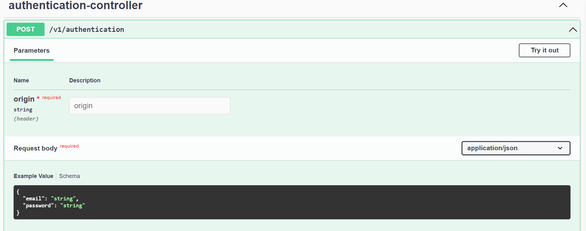
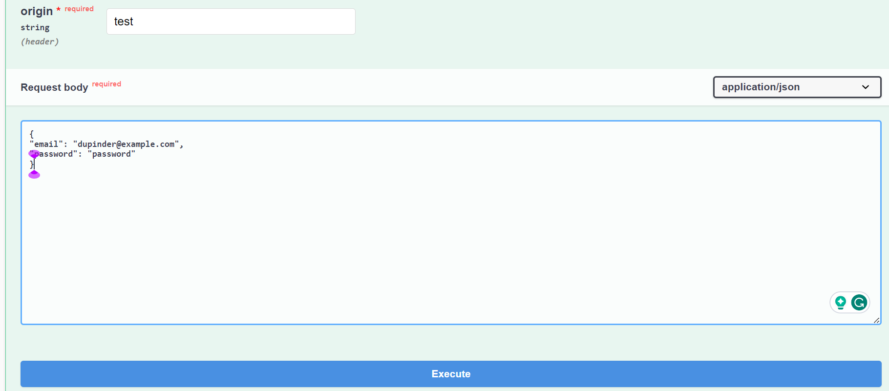
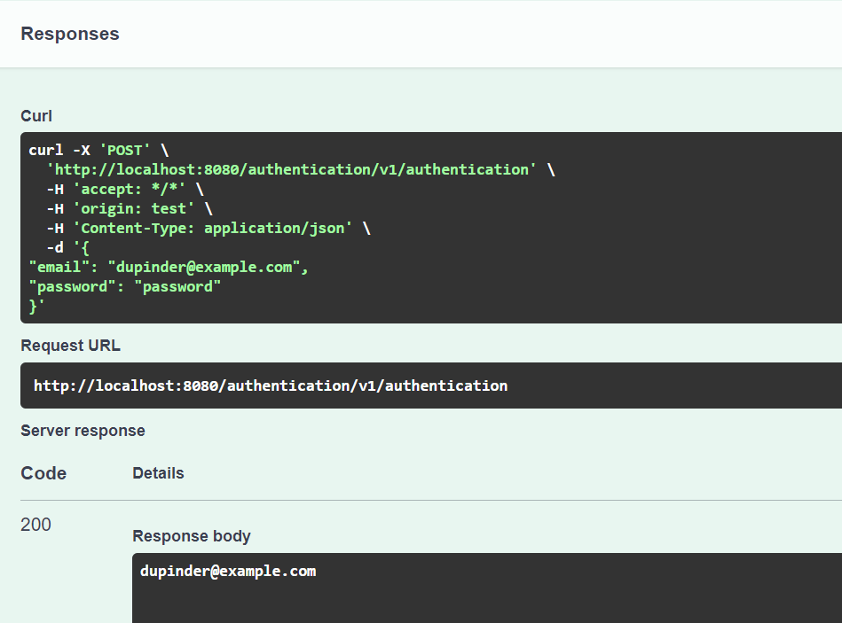

## Basic authentication application
This is a basic authentication application in Reactive SpringBoot 3.0.x with R2dbc

* I configured Flyway with Webflux application. Flyway is not compatible with R2dbc, so I configured JDBC for flyway to migrate database. 

* I configured in-memory database (h2) for E2E tests and MSSQL database for production. 

* I made this project as Multi-tenant application. I tried to explain how we should separate our external dependencies from our service/app's main logic. 
Like you can find a directory under
```
src/main/java/com.dupinder.identityauthentication.external
```
You can see a directory tenancy which is helping to identify tenant or main application for which this microservice is serving, 
under tenancy we can see main 2 classes `TenancyResolverImpl` and `TenancyResolverStub` and one another class TenancyResolver which is an interface. what I am doing here is very simple, it's inversion of control and dependency injection. Based on my requirement I can create a bean of TenancyResolver, if I am runnig tests and I don't want to connect to external service (ofcourse) then I will create Object of `TenancyResolverStub` otherwise when my application is running in the production then I create object of `TenancyResolverImpl` so that I can connect with actual service and resolve tenancy in real time. 

* Configured Swagger Open API Docs. 

# Lets boot it
* You can boot with `H2BootLocal` in IntelliJ, if you don't want to configure MSSQL database.
* Open URL http://localhost:8080/authentication/swagger-ui.html 
* We have configured 3 users already, so you can test them out.
* 
* Add origin as `test`
* add following request body and execute
```
{
"email": "dupinder@example.com",
"password": "password"
}
```




# Response
